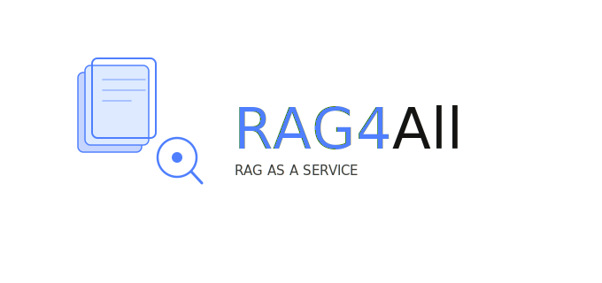

<p align="center">
  
</p>

<p align="center">
  <b>Chatbot for all.</b> Upload your docs, embed one line of code, answer visitors from your own content — not generic AI guesses.
</p>

<p align="center">
  <a href="https://github.com/mdvohra/RAG4All">Mohammad Vohra</a>
  · AI Engineer
  · <a href="mailto:mdvohra52@gmail.com">mdvohra52@gmail.com</a>
</p>

<p align="center">
  <a href="https://hub.docker.com/r/mohds5252/rag4all-api"></a>
  <a href="https://github.com/mdvohra/RAG4All"></a>
  
  
</p>

<p align="center">
  <a href="#what-it-is">What it is</a> &middot;
  <a href="#quick-start">Quick start</a> &middot;
  <a href="#how-it-works">How it works</a> &middot;
  <a href="#embed-the-widget">Embed</a> &middot;
  <a href="#configuration">Configuration</a>
</p>

---

```bash
git clone https://github.com/mdvohra/RAG4All.git
cd RAG4All
cp .env.example .env   # set OPENAI_API_KEY, SECRET_KEY, API_KEY, WIDGET_KEY
docker compose pull
docker compose up -d
```

Then open **http://localhost:8080** — setup wizard walks you through LLM config and gives you the embed snippet.

> **No build step.** This repo pulls pre-built images from
> [`mohds5252/*` on Docker Hub](https://hub.docker.com/u/mohds5252). You only need
> [Docker](https://docs.docker.com/get-docker/) and a `.env` file.

## What it is

RAG4All is a **single-tenant** RAG chatbot you run on your own machine or server. You upload
PDFs and docs, point it at your LLM (OpenAI, Claude, Gemini, Ollama, or a custom API), and paste
a `<script>` tag on any website. Visitors get answers grounded in **your** content — with citations
when configured.

This deploy package is intentionally minimal: `docker-compose.yml`, `.env.example`, and nothing
else to clone. No signup, no multi-tenant accounts — one chatbot, one stack, yours.

| Service | URL | What it does |
| ------- | --- | ------------ |
| Setup wizard | http://localhost:8080 | First-run guide, LLM test, embed code |
| Document manager | http://localhost:8090 | Upload and manage knowledge-base files |
| API + widget JS | http://localhost:8000 | REST API and `/widget/v1/embed.js` |
| API health | http://localhost:8000/v1/health | Readiness check |
| MinIO console | http://localhost:9001 | Object storage (optional, for debugging) |

## Quick start

**Requirements:** Docker 24+ with Compose v2, 4 GB+ RAM, and an LLM API key (OpenAI shown below).

```bash
git clone https://github.com/mdvohra/RAG4All.git
cd RAG4All

cp .env.example .env
```

Edit `.env` — at minimum set `SECRET_KEY`, `API_KEY`, `WIDGET_KEY`, and `OPENAI_API_KEY`:

```bash
docker compose pull
docker compose up -d
```

First startup takes about a minute while Postgres initializes, migrations run, and the default
tenant is seeded.

### What to do next

1. **http://localhost:8080** — run the setup wizard (test LLM connection, copy embed snippet).
2. **http://localhost:8090** — upload your documents (PDF, TXT, etc.).
3. Paste the embed snippet on the site you set as `SITE_URL` in `.env`.

### Stop / reset

```bash
docker compose down          # stop containers, keep data
docker compose down -v       # stop and wipe volumes (fresh start)
```

## How it works

```
  Upload docs          Embed one script           Visitor asks
       │                      │                        │
       ▼                      ▼                        ▼
  ┌─────────┐    ┌────────────────────────┐    ┌──────────────┐
  │ Admin   │    │  Your website          │    │  RAG4All API │
  │ UI :8090│───▶│  + widget (embed.js)   │───▶│  + worker    │
  └─────────┘    └────────────────────────┘    └──────┬───────┘
       │                                            │
       └────────────── pgvector + MinIO ◀────────────┘
                    (chunk, embed, retrieve)
```

1. **Ingest** — documents are chunked and embedded into a pgvector index.
2. **Retrieve** — visitor questions fetch the most relevant chunks (hybrid search when enabled).
3. **Generate** — your configured LLM answers using only retrieved context.
4. **Embed** — the widget loads on any page via a single async `<script>` tag.

## Embed the widget

Keys come from your `.env` (`WIDGET_KEY`, `API_KEY`). Example for local dev:

```html
<script
  src="http://localhost:8000/widget/v1/embed.js"
  data-widget-key="wk_dev_widget_key_change_me"
  data-api-url="http://localhost:8000"
  data-site-url="http://localhost:3000"
  async></script>
```

Replace `data-site-url` with the URL where the widget is embedded (must match `SITE_URL` in `.env`).

## Configuration

All app settings live in `.env`. Copy from `.env.example`:

| Variable | Description |
| -------- | ----------- |
| `SECRET_KEY` | App signing secret — use a long random string |
| `API_KEY` | Bearer token for admin upload API (used in Document manager) |
| `WIDGET_KEY` | Public key in the embed snippet |
| `SITE_URL` | URL where you embed the chatbot |
| `OPENAI_API_KEY` | Your LLM provider key (when `LLM_PROVIDER=openai`) |
| `LLM_PROVIDER` / `LLM_MODEL` | Provider and model name |
| `EMBEDDING_PROVIDER` / `EMBEDDING_MODEL` | Embedding model for document index |

`DEPLOYMENT_MODE` is locked to `single_tenant` in `docker-compose.yml`. Multi-tenant signup
is not available in this package.

<details>
<summary><strong>Example: OpenAI in <code>.env</code></strong></summary>

```env
LLM_PROVIDER=openai
LLM_MODEL=gpt-4o-mini
OPENAI_API_KEY=sk-your-key-here
EMBEDDING_PROVIDER=openai
EMBEDDING_MODEL=text-embedding-3-small
EMBEDDING_DIMENSION=1536
```

</details>

## Docker images

Pre-built on Docker Hub — no source clone or `docker build` required:

| Image | Role |
| ----- | ---- |
| [`mohds5252/rag4all-api`](https://hub.docker.com/r/mohds5252/rag4all-api) | FastAPI backend + background worker + widget bundle |
| [`mohds5252/rag4all-setup-wizard`](https://hub.docker.com/r/mohds5252/rag4all-setup-wizard) | First-run setup UI |
| [`mohds5252/rag4all-admin-ui`](https://hub.docker.com/r/mohds5252/rag4all-admin-ui) | Document upload manager |

Infrastructure images (pulled automatically): `pgvector/pgvector`, `redis`, `minio/minio`.

## Repo layout

| File | Purpose |
| ---- | ------- |
| `docker-compose.yml` | Full local stack |
| `.env.example` | Environment template — copy to `.env` |
| `RAG4All_logo.svg` | Brand logo |
| `LICENSE` | MIT |

## About

Built by **Mohammad Vohra** — AI Engineer. Collaborations welcome:
[mdvohra52@gmail.com](mailto:mdvohra52@gmail.com) · [GitHub](https://github.com/mdvohra)

## License

MIT — see [LICENSE](LICENSE).
